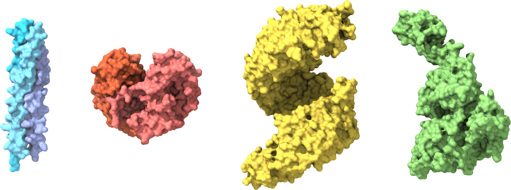

# Strukturna biologija

Dobrodošli v fascinantnem svetu strukturne biologije, discipline, ki je z razvojem novih tehnologij, metod in pristopov konec 20. in še posebej v začetku 21. stoletja doživela pravi razcvet. Ta izjemen napredek, ki je v ospredje namesto organizmov, njihovih delov in celic postavil molekule in to pri atomski ločljivosti, je pripeljal strukturno biologijo do točke, kjer ima ključno vlogo pri oblikovanju našega razumevanja molekularnih osnov procesov, ki se odvijajo v živih organizmih, s tem pa tudi zdravja in bolezni. Z razumevanjem molekulskih struktur tako pridobivamo vpogled, ki sega onkraj meja laboratorija, pomembno vpliva na razvoj novih terapevtskih pristopov in spodbuja biotehnološke inovacije.

Strukturni biolog mora imeti številna znanja – ključne so dobre osnove iz kemije, biologije in fizike, nepogrešljive pa so tudi veščine bioinformatike. Nenazadnje mora imeti sposobnost prostorske predstave – danes nam pri tem lahko vsaj malce pomagajo orodja za vizualizacijo struktur. Ravno pomoč pri vizualizaciji je glavni namen te spletne knjige, saj vsebuje številne predpripravljene "scene", ki omogočajo ogled in manipulacijo modelov struktur bioloških makromolekul, to pa nadgrajuje s kratkimi razlagami in napotki za pridobivanje strukturnih podatkov iz javno dostopnih zbirk in njihovo analizo z izbranimi orodji. Tako se lahko tudi sami podate na raziskovanje lepot veličastnega molekularnega sveta!

Pričujoča spletna knjiga je dodatno študijsko gradivo pri predmetu **Struktura proteinov** v okviru univerzitetnega študijskega programa **Biokemija** na [**Univerzi v Ljubljani**](https://www.uni-lj.si/), [**Fakulteti za kemijo in kemijsko tehnologijo**](https://fkkt.uni-lj.si/).


Glavno študijsko gradivo so drsnice s predavanj (naložene so v [spletno učilnico UL FKKT](https://ucilnica.fkkt.uni-lj.si) pod predmet **Struktura proteinov**), knjige, predpisane v predmetniku, in tekoča znanstvena literatura (izbrani raziskovalni in pregledni članki).

(opomba-povratna-info)=
```{admonition} Opomba
:class: note
Spletna knjiga je v nastajanju in bo kot taka sproti dopolnjena in posodobljena. Priporočam, da si med zaznamke shranite samo osnovni naslov [https://mpavsic.github.io/sbio](https://mpavsic.github.io/sbio), saj se lahko naslovi podstrani v primeru reorganizacije vsebine spremenijo. Če v knjigi najdete napako mi to sporočite preko klika na ikono GitHub na vrhu dotične strani > `Suggest edit` (predlagajte popravek) ali `Open issue` (pokomentirajte).
```

---

Pri pripravi logotipa je bila uporabljena modificirana abeceda kristalnih struktur {cite:p}`Howarth2015aaa` – zamenjana črka 'b' (PDB [5IZK](https://www.rcsb.org/structure/5IZK)), dodan <i class="fa fa-heart" style="color:Red"></i> (PDB [4MZV](https://www.rcsb.org/structure/4MZV)).