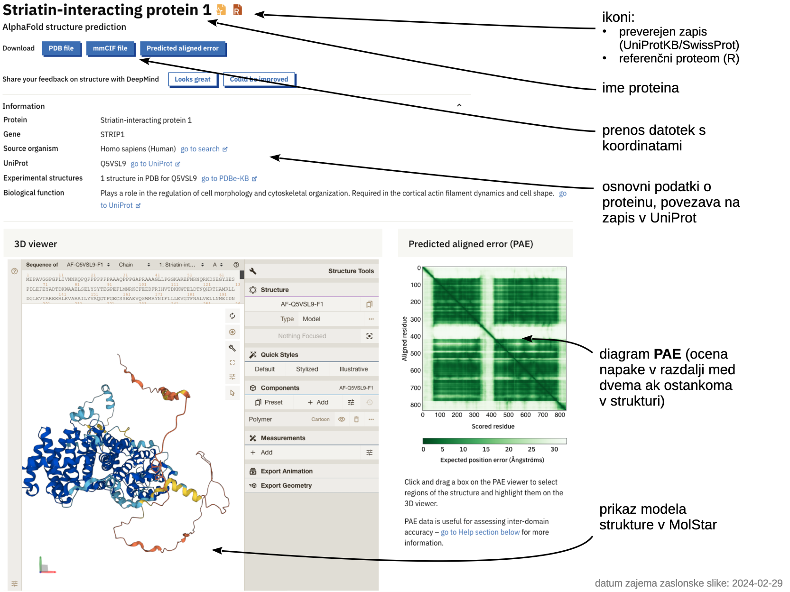

# Modeli

Modele struktur si lahko z uporabo različnih orodij kot so AlphaFold, RoseTTAFold, MODELLER ipd. izračunamo sami, enostavneje in včasih popolnoma primerno pa je uporabiti avtomatsko zgenerirane modele, ki so deponirani v eno izmed zbirk. Če želimo pripraviti model skrajšane oblike proteina, uvesti mutacije ipd. je seveda edino smiselno da model izračunamo sami.

## AlphaFold Protein Structure Database

Ena izmed najpogosteje uporabljanih zbirk modelov proteinskih struktur je [**AlphaFold Protein Structure Database**](https://alphafold.ebi.ac.uk/), za katero skrbi [European Bioinformatics Institute (EBI)](https://www.ebi.ac.uk/) pod okriljem [European Molecular Biology Laboratory (EMBL)](https://www.embl.org/). Modeli za zaporedja v zbirki [UniProt](https://www.uniprot.org/) zgenerirani avtomatsko, po zbirki pa lahko iščemo z imenom proteina ali gena, kodo za dostop do zapisa v UniProt, imenom organizma, lahko pa tudi z aminokislinskim zaporedjem (v tem primeru dobimo kot zadetke iskanja modele struktur z identičnim ali podobnim aminokislinskim zaporedjem). Za nekatere t.i. referenčne proteome, torej nabore proteinov iz določenega organizma, so zgenerirani modeli za vse te proteine.

Modele si lahko ogledamo neposredno na spletni strani zbirke in sicer preko integriranega orodja MolStar, koordinate atomov v formatih PDB in mmCIF pa si lahko prenesemo za analizo v drugih lokalno nainstaliranih programih. Modeli so privzeto pobarvani glede na zanesljivost (vrednost pLDDT, *predicted local distance difference test*, razpon 0–100), komplementaren podatek pa je diagram z vrednostmi PAE (*Predicted aligned error*), ki nam pove oceno napake v razalji med dvema aminokislinskima ostankoma (razpon 0–35 Å; manjša je, bolje je). Del območja v diagramu PAE lahko označimo, avtomatsko se označi ekvivalenten del modela strukture. Več o tem bomo povedali pri predmetu [Biokemijska informatika](https://mpavsic.github.io/biokeminfo/).

Spodaj je prikazan primer zapisa, kjer je polipeptidna veriga pobarvana glede na pLDDT (visoke vrednosti so povezane z višjo zanesljivostjo tistega dela modela strukture).

## ModelArchive

[**ModelArchive**](https://www.modelarchive.org/) vzdržuje [Swiss Institute of Bioinformatics (SIB)](https://www.sib.swiss/). Primarni namen je bil omogočiti denponiranje in javni dostop do modelov struktur, ki niso bili določeni primarno z eksperimentalnimi pristopi (X-žarkovna kristalografija, NMR spektroskopija, krio-EM ipd.). Namreč, zaradi leta 2006 vspostavljenih smernic modeli struktur, primarno izračunani brez eksperimentalnih podatkov, niso smeli biti deponirani v PDB {cite:p}`Berman2006aaa`. Tako je še sedaj, so pa sedaj [v PDB povezave na te modele](pdb-modeli).

(pdb-modeli)=
## Modeli v zbirki PDB

Pri [opisu vsebine zbirke RCSB PDB](pdb-vsebina) je že bilo omenjeno, da ta zbirka vsebuje povezave na modele, izračunane/zgenerirane s pomočjo AlphaFold in drugih orodij. Pri RCSB so pripravili 30 min dolg posnetek, ki zelo nazorno prikaže možnosti, ki nam jih tak dostop ponuja:

<iframe width="560" height="315" src="https://www.youtube.com/embed/z51RVkPnrf0?si=nhrsMP_NCekVdSWA" title="YouTube video player" frameborder="0" allow="accelerometer; autoplay; clipboard-write; encrypted-media; gyroscope; picture-in-picture; web-share" allowfullscreen></iframe>

