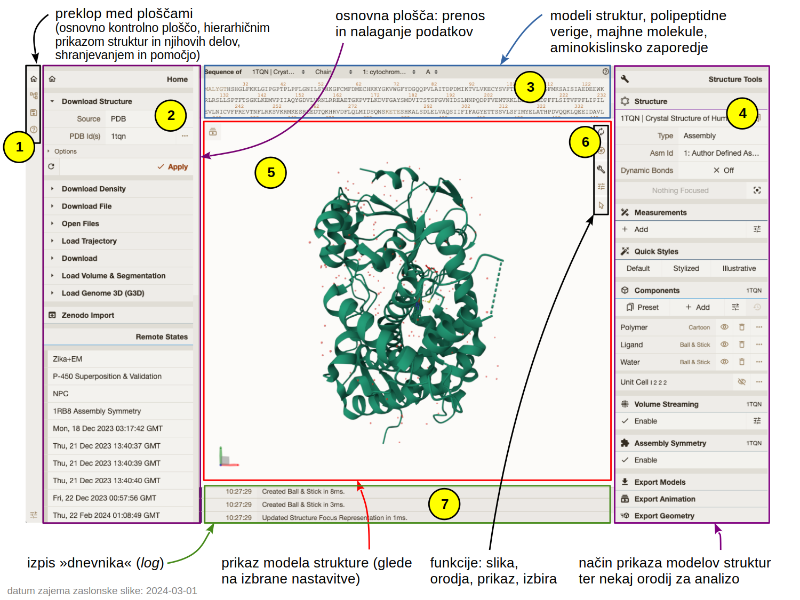

# MolStar

## Uvod

**Mol\* oz. MolStar** je sodobno spletno orodje z odprtokodno licenco, ki omogoča vizualizacijo in analizo struktur bioloških makromolekul ter njihovih kompleksov (tudi do velikosti celotnih virusov) {cite:p}`Sehnal2021aaa`. Sestavljeno je iz večih komponent, ki omogočajo pridobivanje strukturnih podatkov iz zbirk ali lokalnih datotek, analizo, shranjevanje sej in stanj ter njihovo vizualizacijo idr. Tehnično gledano se komponenta za vizualizacijo imenuje **Mol\* Viewer**, a bo za oboje na tej strani zaradi enostavnosti uporabljeno kar poimenovanje MolStar.

Pri razvoju so sodelovali in ga financirali [PDBe](https://pdbe.org/) (EMBL-EBI), [RCSB PDB](https://rcsb.org/) (USA), [Central European Institute of Technology](https://ceitec.cz/) (CEITEC; Češka) in [ELIXIR CZ](https://www.elixir-czech.cz/services) (Češka).

## Dostop

Program je zasnovan tako, da teče na strežniku, z njim pa interagiramo preko spletnega brskalnika (možna je sicer tudi [lokalna instalacija](molstar-lokalno)). V osnovi ga lahko uporabljamo na:
- [spletni strani programa MolStar](https://molstar.org/), kjer kliknemo na gumb [**Open Mol\* Viewer**](https://molstar.org/viewer), ali
- spletnih straneh različnih zbirk strukturnih podatkov kot sta RCSB PDB in PDBe (opisano [tukaj](zbirke-eksperimentalne.md)), pa tudi AlphaFold Protein Structure Database (opisano [tukaj](modeli.md)) in nekaterih [drugih](https://molstar.org/viewer-docs/integrations/) – pri tem gre za to, da do vizualizacij posameznih modelov iz teh zbirk dostopamo zgolj z enim klikom brez vpisovanja kod za dostop oz. identifikatorjev zapisov, prav tako pa nekatere zbirke omogočajo posebne načine vizualizacije (npr. barvanje po pLDDT pri AlphaFold modelih).
  - **Bistvena razlika med MolStar na "uradni" spletni strani ter med implementacijami na straneh kot je RCSB PDB je ta, da pri slednjih (ponavadi) ni možno naložiti lokalnih datotek PDB/mmCIF ali shranjenih sej, prav tako sej ni mogoče shraniti.** Omejeni ste torej na ogled datotek, ki jih gosti dotična zbirka.

MolStar koda je dostopna na [GitHub repozitoriju](https://github.com/molstar), kar pomeni, da bi si ga z nekaj truda lahko celo sami namestili na lasten strežnik, prav tako sta na voljo implementaciji na strani [RCSB PDB](https://github.com/molstar/rcsb-molstar) in [PDBe](https://github.com/molstar/pdbe-molstar).

```{admonition} Razlike med navodili in dejanskim stanjem
:class: attention
Zaradi še vedno aktivnega razvoja MolStar se lahko zgodi, da pride do posodobitve spletne oblike programa, dokumentacija oz. navodila za uporabo na različnih spletnih straneh (nekaj jih najdete [spodaj](molstar-dodatni-viri)) pa prikazuje uporabo na prejšnji različici programa. To je tudi eden izmed razlogov, da na tej strani ni podrobnih navodil za uporabo.
```

## Uporaba

V nadaljevanju je opisana uporaba [MolStar na "uradni" strani programa](https://molstar.org/viewer), uporaba na npr. RCSB PDB je praktično identična (le nekaj manj možnosti je na voljo, predvsem v smislu shranjevanja sej in odpiranja lokalno shranjenih datotek).

Uporabniški vmesnik lahko razdelimo na več "plošč" (*panels*) in še nekaj dodatnih gumbov:



Skrajno levi vertikalni meni (oznaka **1**) nam omogoča preklapljanje med različnimi levimi ploščami (polje **2**) in sicer od zgoraj navzdol:
- ***Home*** za nalaganje struktur iz zbirke PDB (in drugih, npr. zbirke modelov AlphaFold, pri slednjih vpišemo UniProt kodo) ter prenos datotek na naš računalnik (ter nekaj dodatnih funkcij) – ta je prikazana na zgornji sliki;
- ***State Tree***, kjer se nam v obliki hierarhije izpisujejo naloženi strukturni podatki (npr. zapisi iz zbirke PDB) ter načini njihove vizualizacije;
- ***Plugin State***, ki nam omogoča shranjevanje posameznih stanj (lahko bi jim tudi rekli 'pogledi'), prav tako pa tudi prenos sej na naš računalnik in njihovo nalaganje;
- ***Help***, kjer je na voljo zgolj osnovna pomoč.

V plošči v sredini zgoraj (oznaka **3**, ***Sequence Panel***) si lahko ogledamo aminokislinsko zaporedje (ali nukleotidno, če gre za nukleinske kisline), prav tako pa so navedeni tudi ligandi in druge molekule (npr. molekule vode). Čisto na vrhu te plošče je več spustnih menijev preko katerih izbiramo molekule oz. verige, katerih zaporedje je prikazano. Ob kliku na oznako aminokislinskega/nukleotidnega ostanka ali na oznako majhne molekule/iona se ta del modela strukture približa v polju za ogled strukture (oznaka **5**), prav tako se ta del in pa bližnji deli (v polmeru 5 Å) prikažejo na način kroglice in paličice. Ta plošča nam preko klikanja na oznake aminokislinskih/nukleotidnih ostankov ter oznak majhnih molekul omogoča tudi njihovo izbiranje in ustvarjanje posebnih 'komponent' strukture (lahko bi jim rekli tudi 'shranjena izbira'), za kar pa moramo aktivirati posebno funkcijo (puščica na dnu menija **6**). Uporaba plošče z zaporedjem je podrobneje opisana v [***Navigating by Sequence***](https://molstar.org/viewer-docs/navigating-by-sequence/).

Plošča **4** omogoča preklapljanje med različnimi pogledi ter vizualizacijo različnih komponent strukture na različne načine, dodajanje oznak, ... Pri tem so komponente lahko nekaj čisto splošnega kot npr. *Protein*, *Ligand* in *Water* (le-te se samodejno ustvarijo), lahko pa jih preko izbiranja delov modela in shranjevanjem te izbire ustvarjamo sami ter jim nato dodajamo različne načine vizualizacije (MolStar jih imenuje ***Components***, načine vizualizacije pa ***Representations***). To je podrobneje opisano pod [***Managing the display***](https://molstar.org/viewer-docs/managing-the-display/). Pri nekaterih strukturah, npr. tistih, določenih z X-žarkovno kristalografijo, imamo tudi možnost prikaza elektronske gostote (***Density***) – starejše strukture tega nimajo, četudi so bile določene s to metodo, saj včasih deponiranje teh podatkov ni bilo obvezno.

Plošča **4** med drugim omogoča tudi meritve razdalj in kotov ter dodajanje poljubnih oznak ([***Measurements***](https://molstar.org/viewer-docs/tips/measurements/)), za kar pa moramo najprej izbrati posamezne atome ali dele molekul, ki jih želimo označiti. Prav tako so tukaj funkcije za superpozicijo večih naloženih modelov struktur, ilustrativen/poenostavljen prikaz ([***Illustrative Style***](https://molstar.org/viewer-docs/tips/illustrative-style/)) ter "hitre" prednastavljene stile ([***Quick Styles***](https://molstar.org/viewer-docs/tips/quick-styles/)) in drugo. Izvozimo lahko celo videoposnetke vrtenja molekul ([***Export Animation***](https://molstar.org/viewer-docs/tips/movie-export/)).

V polju **5** (***3D Canvas***) vidimo model strukture, prikazan na izbran način. Lahko ga vrtimo in približujemo/oddaljujemo, klik na nek del strukture pa nam ta del postavi v središče ter podrobneje prikaže okoliške ostanke/atome – podobno, kot če bi kliknili na nek ostanek v zaporedju (opisano zgoraj). Načini manipulacije so opisani [tukaj](https://molstar.org/viewer-docs/), kjer najdete tudi podrobnejše opise gumbov pod oznako **6** (***Toggle Menu***) – slednji omogočajo ponastavitev pogleda v smislu pozicije "kamere" ter smeri gledanja, shranjevanje statičnih slik (npr. v formatu PNG), vklop/izklop plošč, pogled z zapolnjenim zaslonom, nastavitve izrisa (ozadje, senčenje, ...) in vklop/izklop funkcije izbiranja ([***Making Selections***](https://molstar.org/viewer-docs/making-selections/)).

Nazadnje imamo na dnu v sredini še t.i. izpis dnevnika (*log*, oznaka **7**), kjer se sproti izpisuje vse, kar počnemo.

Priporočam ogled pogosto zastavljenih vprašanj in odgovorov nanja – [**FAQ**](https://molstar.org/viewer-docs/faqs-scenarios/) ter "plonkca" – [**Mol\* Cheat Sheet**](https://molstar.org/viewer-docs/mol_-cheat-sheet/).

```{admonition} Miška
:class: hint
Priporočam uporabo miške, ki omogoča levi in desni klik ter kolešček (sredinski klik), saj to bistveno olajša manipulacijo struktur v 3D.
```

```{admonition} Podrobna navodila
:class: seealso
Za podrobna navodila si oglejte [uradno dokumentacijo](https://molstar.org/viewer-docs/) ter druge [dodatne vire](molstar-dodatni-viri).
```

```{admonition} Učite se iz primerov
:class: hint
Vse interaktivne [vizualizacije molekul](../strukture/navodila.md), ki so pripravljene v tej spletni knjigi in jih uporabljamo med predavanji, so prav tako ustvarjene v programu MolStar. Privzeto so pri teh prikazih kontrolne plošče skrite, lahko pa si jih prikažete s klikom na simbol za orodni ključ (<i class="fa-solid fa-wrench"></i>) in analizirate seje v smislu komponent in načina njihovega prikaza.
```

## Shranjevanje sej

Seje shranimo tako, da v meniju na skrajno levi strani zgoraj (oznaka **1**) kliknemo na ikono <i class="fa-solid fa-floppy-disk"></i>, nato pa kliknemo na **Session**. Na naš računalnik se nam prenese datoteka s končnico `molx`, ki jo lahko ponovno naložimo v MolStar preko klika na **Open**. Lahk joo spreminjamo in spet prenesemo (spremenjeno) sejo na naš računalnik.

Pozor – bolje je shranjevati seje kot 'Session' in ne zgolj kot 'State' (stanje), saj se pri 'State' morebitne koordinate iz datotek PDB, ki jih prenesemo z našega računalnika, ne shranijo v datoteko s sejo.

(molstar-lokalno)=
## Lokalna instalacija
1. S kombinacijo tipk (`Ctrl`+`Shift`+`P` na Linux in Windows, `Command`+`Shift`+`P` na macOS) odprete "ukazno ploščo" (*command palette*) in začnete tipkati npr. Protein $\rightarrow$ ponudilo vam bo 'Start Protein Viewer', kar izberete in potrdite v pritiskom na 'Enter' $\rightarrow$ vpraša vas po kodi zapisa v PDB ali UniProt. Če želite odpreti lokalno shranjeno datoteko ali kasneje izbrati, kaj boste odprli, ne vnašajte ničesar ampak samo pritisnite tipko 'Enter' ali 'Esc', da se vam odpre program brez naložene strukture.
2. V vertikalni orodni vrstici na skrajno levi strani za disketo ('Plugin State'), kliknete na 'Open' in izberete datoteko formata `molx` na lokalnem disku (deluje tudi za npr. `pdb` in `cif` datoteke).
3. Od tu naprej je uporaba enaka kot za MolStar, ki teče v brskalniku preko spletne strani [MolStar Viewer](https://molstar.org/viewer/).


(molstar-dodatni-viri)=
## Dodatni viri
- [dokumentacija](https://molstar.org/viewer-docs/) na "uradni" strani MolStar
- [Exploring PDB structures in 3D with Mol\* (MolStar)](https://www.youtube.com/playlist?list=PLHib7JgKNUUeG1kMKLMtWwds-pIvvf4iU) (več posameznih video posnetkov) @ RCSB YouTube kanal
- [Mol\* at PDBe webinar](https://www.youtube.com/watch?v=Yv2dApiymxY)
