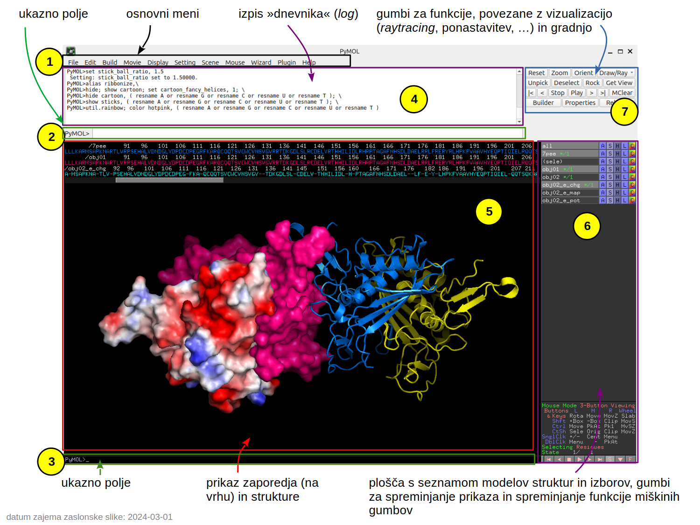

# PyMOL

PyMOL je program za vizualizacijo molekul, ki ga [namestimo lokalno](pymol-namestitev), podobno kot UCSF Chimera/ChimeraX. V osnovi gre za odprtokoden program, ki ga je ustvaril bioinformatik [Warren Lyford DeLano](https://en.wikipedia.org/wiki/Warren_Lyford_DeLano), kasneje pa ga je komercializiralo podjetje DeLano Scientific LLC ([uradna stran](https://pymol.org/)). Program je sicer bil še vedno brezplačno dostopen, proti plačilu pa je bilo moč dobiti podporo in nekatere dodatne funkcije. Podobno je danes, ko nad PyMOL-om bdi podjetje Schrödinger, Inc. Sámo ime programa izhaja iz **Py**thon in **MOL**ecule.

## Uporaba

Okno programa je sestavljeno iz večih delov, vsak ima svojo funkcijo:

Na vrhu okna najdemo osnovni meni (**1**), kjer dostopamo do funkcij za nalaganje in shranjevanje podatkov (***File***), gradnjo modelov (***Build***), pripravo videoposnetkov (***Movie***), spreminjanje in druge nastavitve prikaza (***Display***, ***Settings***), delo s scenami (***Scene***), spreminjanjem funkcij miškinih gumbov (***Mouse***; te možnosti so tudi na dnu plošče **6**), čarovnikom za prikaz in nekatere funkcije (***Wizard***), vtičnike (***Plugin***) ter pomoč (***Help***), ki nas pravzaprav pripelje na spletne strani z navodili in primeri uporabe.

Številne dodatne funkcije, do katerih včasih sploh ni mogoče dostopati preko menija, so na voljo preko dveh ukaznih polj (**2**, **3**). Karkoli počnemo se izpisuje v dnevniškem polju (**4**).

Večji del okna, označen s **5**, je namenjen 3D prikazu modelov strukture, na vrhu pa se nahaja aminokislinsko ali nukleotidno zaporedje ter oznake ligandov itd., prikaz tega pa moramo posebej vključiti preko osnovnega menija `Display > Sequence`. Za spreminjanje prikaza posameznih molekul ali njihovih delov je ključno polje **6***. Tukaj najdemo na vrhu seznam vseh modelov, (shranjenih) izborov ipd., vsak od teh objektov/izbrov pa ima 5 gumbov:
- **A** kot ***A****ction*: fokusiranje, prikaz elektrostatike in interakcij, ...;
- **S** kot ***S****how*: vklapljanje določenega načina prikaza;
- **H** kot ***H****ide*: izklapljanje določenega načina prikaza;
- **L** kot ***L****abel*: delo z oznakami;
- **C** kot ***C****olor*: barvanje.

Program omogoča izjemno število funkcij, za napredno uporabo pa se je vsekakor potrebno naučiti nekaj [ukazov](https://pymol.org/pymol-command-ref.html) in [sintakse za izbiro molekul ali njihovih delov](https://pymolwiki.org/index.php/Selection_Algebra). Za podrobno seznanitev s programom priporočam branje navodil in ogled videovodičev na YouTube, povezave na nekatere najdete pod [dodatnimi viri](pymol-dodatni-viri).

(pymol-namestitev)=
## Namestitev

Koda za PyMOL je sicer dostopna (z izjemo nekaj posebnih funkcij), a povprečen uporabnik računalnika hitro naleti na težave pri instalaciji – binarnih paketov (t.j. prevedene kode, ki jo lahko zaženemo kot običajne programe) podjetje Schrödinger ne zagotavlja, razen če plačate kar drago licenco (v tem primeru dobimo t.i. *Incentive PyMOL*). Finančno oviro lahko enostavno zaobidemo – uporabimo *Open-Source PyMOL*. Tu so na boljšem uporabniki sistemov GNU/Linux in macOS, ki jih do funkcionalnega PyMOL-a loči načeloma le malce tipkanja po ukazni vrstici ali celo zgolj nekaj klikov po programu za nameščanje paketov.

### GNU/Linux

Za nekatere distribucije, npr. [Ubuntu Linux](https://ubuntu.com/), je v repozitoriju na voljo že preveden paket, kar je na splošno opisano [tukaj](https://pymolwiki.org/index.php/Linux_Install). Na primer, v Ubuntu ga lahko enostavno namestite v terminalu s `sudo apt install pymol` ter nato zaženete s `pymol`.

### macOS

Priporočam instalacijo binarnega paketa preko Homebrew:
- najprej namestite [Homebrew](https://brew.sh/), sledite navodilom na spletni strani;
- PyMOL namestite preko terminala z `brew install brewsci/bio/pymol` ter nato zaženete s `pymol`.

Drugi načini instalacije so opisani [tukaj](https://pymolwiki.org/index.php/MAC_Install).

### Windows

Najlažje je do binarnega paketa moč priti preko oddaje izpolnjenega [obrazca](https://pymol.org/edu/), a ta verzija PyMOL-a je namenjena uporabi zgolj v izobraževanju in ima nekatere omejitve, npr. ni mogoče pripraviti kvalitetnih slik struktur pri visoki ločljivosti.

Neokrnjen PyMOL je "najlažje" namestiti po [navodilih](https://pymolwiki.org/index.php/Windows_Install) na PyMOL Wiki in sicer namestite Python ter Microsoft Visual C++, prenesite potrebne *wheel* pakete (PyMOL, Numpy, ...) ter ustvarite izvršilno datoteko. Vso srečo!

(pymol-dodatni-viri)=
## Dodatni viri
- [PyMOL Wiki](https://pymolwiki.org/)
  - priporočam ogled [Biochemistry student intro](https://pymolwiki.org/index.php/Biochemistry_student_intro), [Practical PyMOL for Beginners](https://pymolwiki.org/index.php/Practical_Pymol_for_Beginners) in strani, navedenih v [kazalu "priročnika"](https://pymolwiki.org/index.php/TOPTOC)
- videovodiči na YouTube:
  - [PyMOL](https://www.youtube.com/watch?v=C_lewbvUyGk) (kanal SBGrid Consortium)
  - [PyMOL for Beginners | Basic Tutorial Molecular Visualization of Proteins](https://www.youtube.com/watch?v=h5wKppcyzOw) (kanal Bioinformatics With BB)
  - [PyMOL Tutorials](https://www.youtube.com/watch?v=mBlMI82JRfI&list=PLUMhYZpMLtal_Z7to3by2ATHP-cI4ma5X) (več videoposnetkov; kanal Molecular Memory)
  - [PyMOL tutorials (long)](https://www.youtube.com/watch?v=o4XR-0VTXrY&list=PLZANrlj_zCh9A2G8RdFUnxqojGukq49Q_) (kanal PyMOL Ross)
- navodila drugih avtorjev:
  - [A Simple Tutorial for PyMOL: Visualising Proteins Using Molecular Graphics](https://dasher.wustl.edu/bio5357/software/pymol/simple-tutorial.pdf) (avtor Dr. Dafyd Jones)
  - [Introduction to PyMOL](https://sites.pitt.edu/~epolinko/IntroPyMOL.pdf) (DeLano Scientific, leto 2009)
  - [A Beginner’s Guide to Molecular Visualization Using PyMOL](https://fitzkee.chemistry.msstate.edu/sites/default/files/bootcamp/2023/session-09_pymol-tutorial.pdf) (avtor Nicholas Fitzkee, leto 2023)