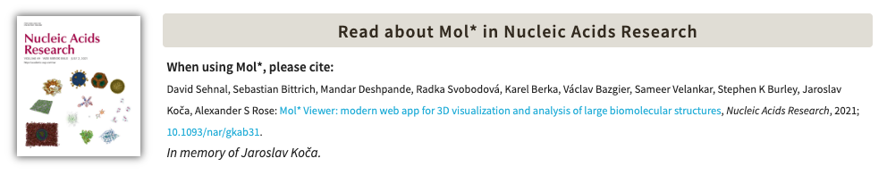

# Vizualizacija struktur

## Uvod

Vizualizacija molekulskih struktur je ključna tako v smislu analize struktur kot tudi posredovanja informacij in znanja drugim. Medtem ko so se pionirji strukturne biologije morali zanašati na ročno narisane skice in fizične modele – primer je [klobasa](https://doi.org/10.1002/pro.3417), ki je predstavljala zvitje polipeptidne verige mioglobina, prvega proteina z eksperimentalno določeno strukturo ([članek](https://doi.org/10.1038/181662a0)) – imamo danes na voljo kopico najrazličnejših računalniških orodij s pomočjo katerih si lahko z zgolj nekaj kliki pričaramo fotorealistične prikaze struktur ne le posameznih makromolekul temveč pravih gigantskih makromolekulskih sistemov. Nekaj malega o zanimivi zgodovini teh orodij od prvih začetkov pa do 1990 lahko preberete [tukaj](https://www.umass.edu/microbio/rasmol/history.htm), mi pa bomo po morju struktur krmarili z bolj [modernimi programi](najpogosteje-uporabljani-programi).

(najpogosteje-uporabljani-programi)=
## Najpogosteje uporabljani programi

Najpogosteje uporabljani orodji za vizualizacijo struktur bioloških makromolekul, ki sta v aktivnem razvoju in za uporabo v nekomercialne namene na voljo brezplačno:
- [**Chimera**](chimera) (UCSF Chimera in ChimeraX) in
- [**PyMOL**](pymol).

Obe orodji zraven vizualizacije omogočata tudi izvajanje analiz struktur – nekaj osnovnih je na voljo že v samem osnovnem programu, zraven tega pa so za oba na voljo številni vtičniki.

Za vizualizacijo se pogosto uporablja tudi [**MolStar**](molstar), sploh z ozirom na njegovo integracijo v spletno stran zbirk PDB, UniProt, AlphaFold in drugih oz. možnostjo uporabe v brskalniku.

*Vse tri zgoraj navedene programe boste spoznali v okviru seminarjev in vaj pri predmetu Struktura proteinov.* Opisi zgoraj navedenih programov so na posebnih podstraneh, katerih namen pa nikakor ni biti (popoln) uporabniški priročnik temveč zgolj seznanjanje z res osnovami uporabe ter relevantnimi spletnimi viri/povezavami, na katerih najdete podrobnejša navodila za uporabo (tudi v obliki videovodičev). **Upoštevajte, da so programi v neprestanem (bolj ali manj aktivnem) razvoju in da so lahko kakšne stvari (meniji ipd.) malce drugačni kot prikazani na teh straneh ter javno dostopnih spletnih uporabniških priročnikih.**

## Drugi programi

Nekatera druga oroda za vizualizacijo, ki jih sicer ne boste srečali tako pogosto in morda niso vsa v aktivnem razvoju, so pa na voljo brezplačno za nekomercialno uporabo:
- [CCM4MG](https://www.ccp4.ac.uk/MG/) (CCP4 Molecular Graphics), ki je del programskega paketa [CCP4](https://www.ccp4.ac.uk/) (Collaborative Computational Project No. 4) za strukturno biologijo s primarnim fokusom na kristalografiji, omogoča pa pripravo kompleksnih vizualizacij in slik, primernih za objavo v člankih. 
- [VMD](https://www.ks.uiuc.edu/Research/vmd/) (Visual Molecular Dynamics), ki je posebej uporaben v navezavi s programom za izvajanje simulacij molekulske dinamike [NAMD](https://www.ks.uiuc.edu/Research/namd/), oba programa je razvila ista skupina (Theoretical and Computational Biophysics Group, University of Illinois, ZDA). Frekvenca izdaje novih verzij je nizka.
- [YASARA](http://www.yasara.org/) (Yet Another Scientific Artificial Reality Application), programski paket za vizualizacijo, modeliranje in simulacijo bioloških makromolekul in makromolekulskih sistemov.
- [Jmol](https://jmol.sourceforge.net/), odprtokodno orodje za vizualizacijo bioloških makromolekul v okolju Java, ki omogoča ogled spletnih struktur na spletu v brskalniku (podobno kot MolStar), lahko pa ga poganjate tudi lokalno (potrebno je namestiti okolje Java).
- [iCn3D](https://structure.ncbi.nlm.nih.gov/Structure/icn3d/), ki podobno kot Jmol in MolStar teče v brskalniku. Na voljo je sicer tudi [Cn3D za lokalno instalacijo](https://www.ncbi.nlm.nih.gov/Structure/CN3D/cn3d.shtml), katerega najnovejša in hkrati zadnja verzija je iz leta 2023 (nove več ne bo!).

Seveda ima vsak od programov samosvoj uporabniški vmesnik. Za prenos in uporabo nekaterih od zgoraj navedenih programov je potrebna registracija.

Na spletu lahko najdete še nekatera druga orodja, prav tako tudi sezname orodij za vizualizacijo kot sta, na primer, seznama na [RCSB PDB](https://www.rcsb.org/docs/additional-resources/molecular-graphics-software) in [Wikipediji](https://en.wikipedia.org/wiki/List_of_molecular_graphics_systems).

## Citiranje

Za vsak program, ki ga uporabljate, je potrebno navesti ustrezno referenco, večinoma gre za članek ali spletno stran. Kaj in kako navesti je napisano na spletni strani posameznega programa, ponavadi v razdelku poimenovanem "*Citing*", "*How to cite*, "*Reference*" ipd. Na primer, na spletni strani MolStar najdemo naslednji zapis:

